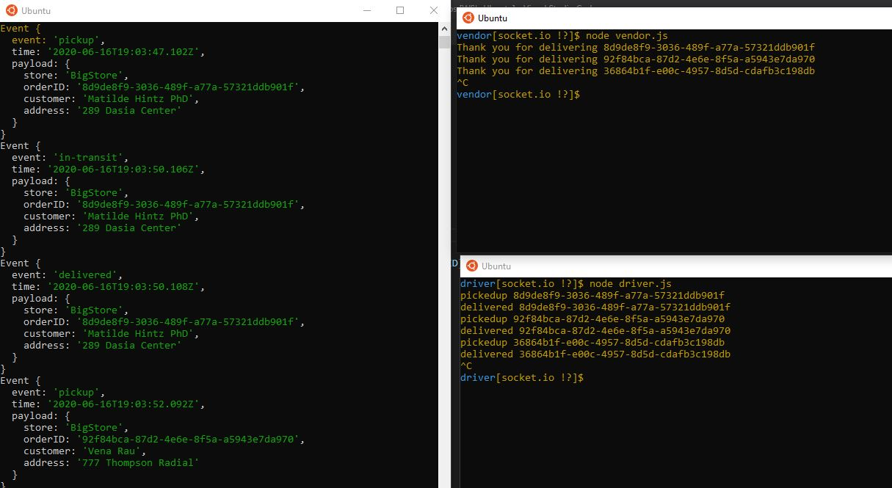
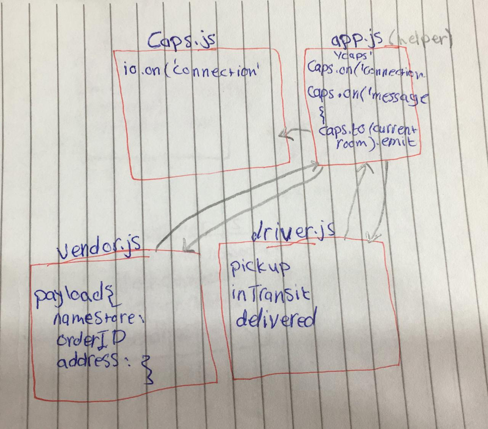

# caps

## class 17
- [pull request](https://github.com/sondos-401-advanced-javascript/caps/pull/3)
- [github action](https://github.com/sondos-401-advanced-javascript/auth-server/actions)

### test
by using `npm test` and `npm run lint`

### Output

### UML
